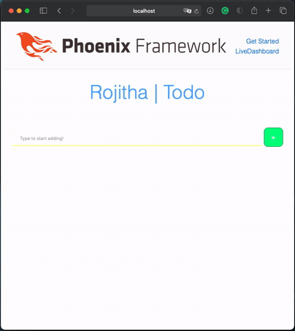
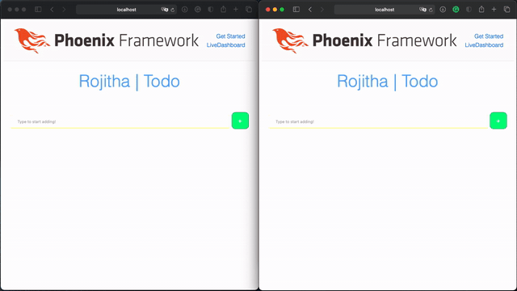

# Qliqsoft Todo Challenge

This project was completed using the Elixir programming language alongside the Phoenix SDK.

**High level goals**
* Minimal design elements.
* Responsive user interface.
* Dynamically updating list.
* Add, completed and delete functionality.
* Test broadcasting capabilities.

## Event handling
```elixir
defmodule LiveViewTodosWeb.TodoLive do
  use LiveViewTodosWeb, :live_view
  alias LiveViewTodos.Todos
  
  def mount(_params, _session, socket) do
    Todos.subscribe()
    {:ok, fetch(socket)}
  end

  def handle_event("add", %{"todo" => todo}, socket) do
    Todos.create_todo(todo)
    {:noreply, socket}
  end
  
  def handle_event("toggle_done", %{"id" => id}, socket) do
    todo = Todos.get_todo!(id)
    Todos.update_todo(todo, %{done: !todo.done})
    {:noreply, socket}
  end
  
  def handle_event("delete", %{"id" => id}, socket) do
    todo = Todos.get_todo!(id)
    Todos.delete_todo(todo)
    {:noreply, socket}
  end
  
  def handle_info({Todos, [:todo | _], _}, socket) do
    {:noreply, fetch(socket)}
  end

  defp fetch(socket) do
    assign(socket, todos: Todos.list_todos())
  end

end
```

## Template & Design
```elixir
<head>
<style>

      .btnAdd {
        display: inline-block;
        background-color: #00FF80;
        border-radius: 10px;
        border: 1px double #088A4B;
        color: #eeeeee;
        text-align: center;
        line-height: 0px;
        font-size: 15px;
        padding: 0px;
        width: 48px;
        height: 48px;
        transition: all 0.5s;
        cursor: pointer;
        margin: 0px;
      }
      .btnAdd span {
        cursor: pointer;
        display: inline-block;
        position: relative;
        transition: 0.5s;
      }
      .btnAdd:hover {
        background-color: #58D3F7;
      }
      
      
      .btnDel {
        display: inline-block;
        background-color: #FF0040;
        border-radius: 10px;
        border: 1px double #B40431;
        color: #eeeeee;
        text-align: center;
        line-height: 0px;
        font-size: 15px;
        padding: 0px;
        width: 10px;
        height: 10px;
        transition: all 0.5s;
        cursor: pointer;
        margin: 0px;
      }
      .btnDel span {
        cursor: pointer;
        display: inline-block;
        position: relative;
        transition: 0.5s;
      }
      .btnDel:hover {
        background-color: #F7819F;
      }
      
      input[type=text] {
        width: 92%;
        padding: 10px 20px;
        margin: 8px 0;
        box-sizing: border-box;
        border: none;
        border-bottom: 1px solid #FFFF00;
    }


      input[type=checkbox]:checked + label {
        color:grey;
        text-decoration: line-through;
    }
    
      label {
        font-size: 15px
    }
    

</style>
</head>

<center><font color = "#58ACFA" size = "20px"><p>Rojitha | Todo</p></font></center>
</br>

<form action="#" phx-submit="add">
  <%= text_input :todo, :title, placeholder: "Type to start adding!" %>
  <%= submit "+", phx_disable_with: "..." , class: "btnAdd", style: "float: right;" %>
</form>

</br>
</br>

<%= for todo <- @todos do %>

<div>
  <%= checkbox(:todo, :done, phx_click: "toggle_done", phx_value_id: todo.id, value: todo.done, style: "float: left;") %>
  <label style="word-wrap: break-word; line-height: 19px; float: left;">&nbsp <%= todo.title %></label>
  <button phx-click="delete" phx-value-id="<%= todo.id %>" class="btnDel" style="float: right;"></button>
  </br></br>
</div>

<% end %>

```

## User interface

**Main view**
<p align="center">
 
</p>

<p align="center" size="10px">
This is the main view on the user end.
</p>

</br>

**Dynamically updating and broadcasting view**
<p align="center">
 
</p>

<p align="center" size="10px">
This demonstrates how the interface dynamically updates and broadcasts all changes.
</p>

</br>

**Responsive design**
<p align="center">
 
</p>

<p align="center" size="10px">
This shows how responsive the design elements are (scaling etc).
</p>
